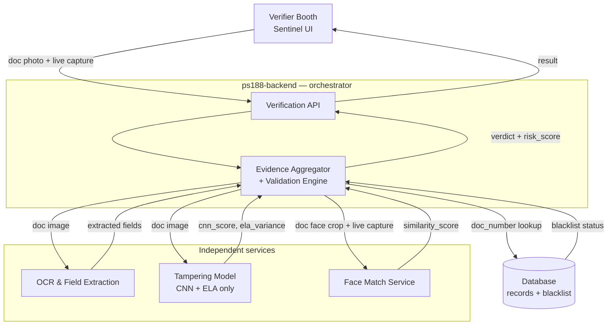
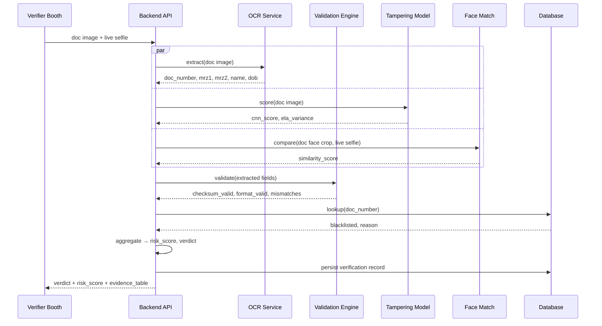

# Sentinel Verification Architecture

**SIH PS 26188 · AI-Based Fake Identity & Document Screening System**
**Scope:** Passport & Aadhaar, phase 1 · **Verdict bands:** GENUINE `<0.25` · SUSPICIOUS `0.25–0.55` · FAKE `≥0.55`

> Full interactive version with diagrams: https://claude.ai/code/artifact/be9d8297-7fa4-4c5a-9878-37ebbeb9e295

---

## 1. Overview

The Problem Statement asks for four things on every document a verifier screens: extract its fields, validate them against the document's own standard, detect visual tampering, and confirm the photo belongs to the person holding it. Right now those four jobs are tangled into one Python service (`passport-model`) that only does the third one reliably.

**The one architectural decision everything below follows from:** the CNN/model service stops being asked to validate anything. It sees a document image and returns two numbers — a visual-authenticity score and a forensic tampering score. Every deterministic check (checksums, formats, blacklist lookups) moves into the backend, where it belongs, because it's just logic, not inference — and where it can run whether or not the model service is even reachable.

---

## 2. System Architecture

Five independent pieces, one orchestrator. The backend is the only component that talks to the database and the only one that combines signals into a verdict — no other service makes a judgment call.



---

## 3. Component Responsibilities

| Component | Status | Input | Output | Does NOT do |
|---|---|---|---|---|
| **Sentinel UI** | exists | Document capture + live selfie capture | Verdict, risk score, evidence breakdown | Any judgment about validity |
| **Backend API** | refactor | Doc image + live selfie | `{verdict, risk_score, evidence_table}` | Runs no ML inference itself |
| **OCR & Extraction** | new | Document image | `doc_number, mrz_line1/2, name, dob, expiry` | Judges whether fields are valid |
| **Tampering Model** | refactor | Document image only | `cnn_score, ela_variance, tampering_flag` | MRZ / Verhoeff / format checks (moving out) |
| **Face Match Service** | new | Doc photo face crop + live selfie | `similarity_score, match: bool` | 1:N search — always one face vs. one face |
| **Blacklist & Records DB** | refactor | `doc_number + doc_type` from backend | `blacklisted: bool, reason, flagged_by` | Any government database — this is Sentinel's own list |

### Why it's split this way

Each piece exists because it answers a *different question*, and bundling them (like the current `passport-model` does) means one bad answer can quietly corrupt another:

- **Sentinel UI** exists because a verifier at a checkpoint needs a fast capture-and-result loop, not a JSON viewer. It stays dumb on purpose — if it had its own opinion about validity, the verdict a verifier sees could disagree with the verdict actually stored.
- **Backend API** exists as the single front door so every other service can be swapped, scaled, or restarted independently without the UI or the other services knowing. It's the only thing that's allowed to make a final call.
- **OCR & Extraction** is its own service because *reading* a document and *judging* it are different skills — an OCR model doesn't need to know what a valid checksum looks like, and a checksum function doesn't need to know anything about image pixels.
- **Tampering Model** is scoped down to CNN + ELA only because that's the one job in this whole pipeline that genuinely requires a trained model. Everything else in the old `predict_pipeline.py` (checksums, format regex) was deterministic code that happened to be sitting in the same file — it doesn't need TensorFlow loaded to run a regex.
- **Face Match Service** is separate because it has a different failure mode than everything else here: it's comparing two photos of a person, not reading a printed field. It's also the one component with a live-capture requirement (the verifier's camera), so it has its own latency and liveness concerns.
- **Blacklist & Records DB** exists because "is this document authentic" and "has this specific document been reported before" are unrelated questions — a perfectly genuine, unaltered passport can still belong to someone on a watchlist, and a well-forged one can still fail every other check.

---

## 4. Request Flow

One verification call, five hops. Every service is called in parallel where it can be — nothing waits on the model service before checking the blacklist.

### Walkthrough: one verification, step by step

1. **Verifier submits.** The booth captures a photo of the document and a live selfie, and sends both to the backend in one request. This is the only point a human is in the loop.
2. **Backend fans out three calls at once** — it doesn't need OCR's answer before it can ask the tampering model to score the image, and it doesn't need the tampering score before it can ask the face service to compare photos. These three don't depend on each other, so running them in parallel is what keeps the whole request from taking 3x as long.
3. **OCR returns raw fields** — doc number, MRZ lines, name, DOB. At this point nothing has been judged valid yet; these are just what the pipeline *read*, not what it *believes*.
4. **Backend runs the Validation Engine** against those raw fields — this step only starts once OCR has answered, because there's nothing to checksum until there's a number to checksum. This is where the ICAO 9303 / Verhoeff math actually happens, and it's pure logic — no model call, no network hop.
5. **Backend checks the blacklist** using the doc number OCR extracted — independent of whether the checksum passed, because a real, valid, unaltered document can still be on a watchlist.
6. **Backend aggregates everything it now has** — validation result, tampering score, face similarity, blacklist status — into one weighted `risk_score` and a verdict band. This is the only step that makes a judgment call; every step before it just produced one signal.
7. **Backend persists the record** (hashed doc number, verdict, timestamp) for the audit trail, then returns the result to the verifier. The record is written *after* the verdict is decided, not before — so a crash mid-aggregation never leaves a half-decided record in the database.



---

## 5. Data Contracts

**OCR Service — response**
```json
{
  "doc_type": "passport",
  "doc_number": "Z1234567",
  "mrz_line1": "P<INDSINGH<<GURPREET<<<<<<<<<<<<<<<<<<<<<<<<",
  "mrz_line2": "Z1234567<1IND8501011M3001018<<<<<<<<<<<<<<02",
  "name": "GURPREET SINGH",
  "dob": "1985-01-01",
  "expiry": "2030-01-01",
  "face_bbox": [0, 0, 0, 0],
  "ocr_confidence": 0.94
}
```

**Tampering Model — response** (scoped down)
```json
{
  "cnn_score": 0.1777,
  "ela_variance": 0.27,
  "tampering_anomaly": false,
  "image_quality": {
    "blur_score": 705.64,
    "resolution": "736x414",
    "glare_ratio": 0
  }
}
```

**Face Match Service — response** (1:1 only)
```json
{
  "similarity_score": 0.82,
  "match": true,
  "threshold_used": 0.75,
  "live_capture_liveness_ok": true
}
```

**Backend — final response** (what the UI renders)
```json
{
  "verdict": "SUSPICIOUS",
  "risk_score": 0.35,
  "reasons": ["Low CNN visual score"],
  "evidence_table": {
    "validation": {},
    "tampering": {},
    "face_match": {},
    "blacklist": { "flagged": false }
  }
}
```

---

## 6. Blacklist & Records

This is Sentinel's own list, not a government database — populated by Admins/Super Admins through the roster tools already built in Phase 1. A `doc_number` showing up here doesn't need OCR to be perfect on every field, only on the one number that gets looked up.

**`blacklist` collection** (keyed on `doc_number`)
```json
{
  "doc_number": "Z1234567",
  "doc_type": "passport",
  "reason": "Reported stolen — FIR 2026/0417",
  "flagged_by": "admin_khanna",
  "flagged_at": "2026-08-14T10:02Z",
  "active": true
}
```

**`verification_records` collection** (audit trail)
```json
{
  "checkpoint_id": "CP-14",
  "verifier_id": "v_202",
  "doc_type": "passport",
  "doc_number_hash": "sha256:...",
  "verdict": "SUSPICIOUS",
  "risk_score": 0.35,
  "timestamp": "2026-09-02T15:54Z"
}
```

---

## 7. Current State vs. Target

| Document | Extraction (OCR) | Validation | Tampering | Face match |
|---|---|---|---|---|
| Passport | missing | logic ready, unfed | working | missing |
| Aadhaar | missing | logic ready, unfed | working | missing |
| Visa | missing | no validator | not routed | missing |
| Driving License | missing | no validator | not routed | missing |
| Permit | missing | no validator | not routed | missing |

---

## 8. Per-Document Implementation Notes

What's actually different about each document type, and how much of the existing code can be reused vs. built fresh.

### Passport — ICAO 9303 TD3
- **Structure:** 2-line Machine Readable Zone, 44 characters/line, set in OCR-B — a font *designed* to be machine-read, so extraction accuracy is high once you're cropping the right band.
- **Extraction:** crop the bottom MRZ strip and run a dedicated MRZ reader (not general text OCR) against just those two lines.
- **Validation:** already built — `indian_passport_verifier.py` has all 4 checksums (passport number, DOB, expiry, composite). It just needs real MRZ text instead of a manually-typed string.
- **Face:** fixed photo position on the bio page — easy crop.
- **Effort:** Low–Medium. Validation is done; the remaining work is MRZ-specific OCR.

### Aadhaar — UIDAI
- **Structure:** no MRZ. Instead it carries a QR code encoding UIDAI-signed demographic data — more reliable than OCR because it's digitally signed and tamper-evident by design.
- **Extraction:** primary path is decoding the QR (`aadhaar_verifier.py` already has `detect_and_read_qr_code`) rather than reading printed text; general OCR of the printed 12-digit number is only a fallback/cross-check.
- **Validation:** already built — Verhoeff checksum. Just needs the decoded number fed in.
- **Face:** fixed photo position — easy crop.
- **Effort:** Low. Most of the hard part (QR decode) already exists; it just isn't wired to the validator yet.

### Visa — ICAO 9303 MRV-A / MRV-B
- **Structure:** also MRZ-based (MRV-A: 2×44 chars, MRV-B: 2×36 chars) — the *same* 7-3-1 checksum algorithm as a passport, just a different field layout and line length.
- **Extraction:** same MRZ-reading technique as passport, with a parser for the shorter visa line format.
- **Validation:** no dedicated verifier class exists yet, but it's an **extension** of `indian_passport_verifier.py`, not a from-scratch build — the checksum math is identical.
- **Entry validation / stay duration:** these are printed, not MRZ-encoded — needs general OCR plus simple date-range logic, no checksum available.
- **Effort:** Medium. Real work, but most of it is reuse.

### Driving License
- **Structure:** no ICAO standard, no check digit. State RTO format only (2-letter state code + 2-digit RTO code + 4-digit year + 7-digit serial, e.g. `MH12 20110012345`).
- **Extraction:** general OCR only — no MRZ zone to lean on for name, DL number, DOB, validity, or vehicle class.
- **Validation:** format regex only — there is no checksum digit, so the number itself can't be cryptographically verified the way a passport or Aadhaar number can.
- **Reality check:** Parivahan/Sarathi (the actual government DL database) has no public API, so a blacklist lookup is the most realistic verification available here — not standards validation.
- **Effort:** Medium–High. New OCR work, and a weaker validation signal than the other two.

### Permit
- **Structure:** undefined. "Permit" isn't one standardized document — it depends on which permit the PS actually means (border-crossing permit, vehicle route permit, something else), and none of those share a common layout or numbering scheme.
- **Recommendation:** get a sample document or the exact spec before building anything here — this is the one type where building blind risks wasted work.
- **Effort:** Unknown until scope is clarified.

**Suggested build order:** Passport → Aadhaar → Visa → Driving License, with Permit parked until its exact document type is confirmed.

---

## 9. Build Roadmap

Ordered by leverage — each phase unblocks the next. Visa / Driving License / Permit are deliberately deferred until Passport and Aadhaar run end-to-end.

1. **OCR & field extraction** — Extract `doc_number`, MRZ lines, name, DOB, expiry from a raw document photo. Unblocks the validation logic that already exists but currently sits idle waiting for fields.
   `MRZ parser` · `text OCR` · `face bbox crop`

2. **Strip the model service down** — Remove checksum/format/geometry logic from `passport-model`. It should expose one endpoint that takes an image and returns `cnn_score` + `ela_variance` — nothing else.
   `/score endpoint` · `drop validators`

3. **Move validation into the backend** — Port the ICAO 9303 and Verhoeff checksum logic (already correct — just relocated) to run against whatever OCR extracts in Phase 1.
   `7-3-1 checksum` · `Verhoeff` · `visual↔MRZ cross-match`

4. **Blacklist collection + lookup** — Add the collection, an admin-facing add/remove flow (the roster UI already has the shell for this), and a lookup call in the aggregator.
   `blacklist collection` · `admin CRUD` · `lookup endpoint`

5. **Face match service** — Live selfie capture in the verifier flow, an embedding model behind a 1:1 comparison endpoint, and a similarity threshold tuned on real captures — not a database search.
   `live capture UI` · `embedding model` · `cosine threshold`

6. **Evidence aggregator** — Combine validation, tampering, face-match, and blacklist signals into one weighted `risk_score` with clear GENUINE / SUSPICIOUS / FAKE bands — replacing the current single-CNN-number verdict.
   `weighted scoring` · `verdict bands` · `evidence_table`

---

*Sentinel · AI-Based Fake Identity & Document Screening System · SIH PS 26188 · Ministry of Home Affairs, SSB*
